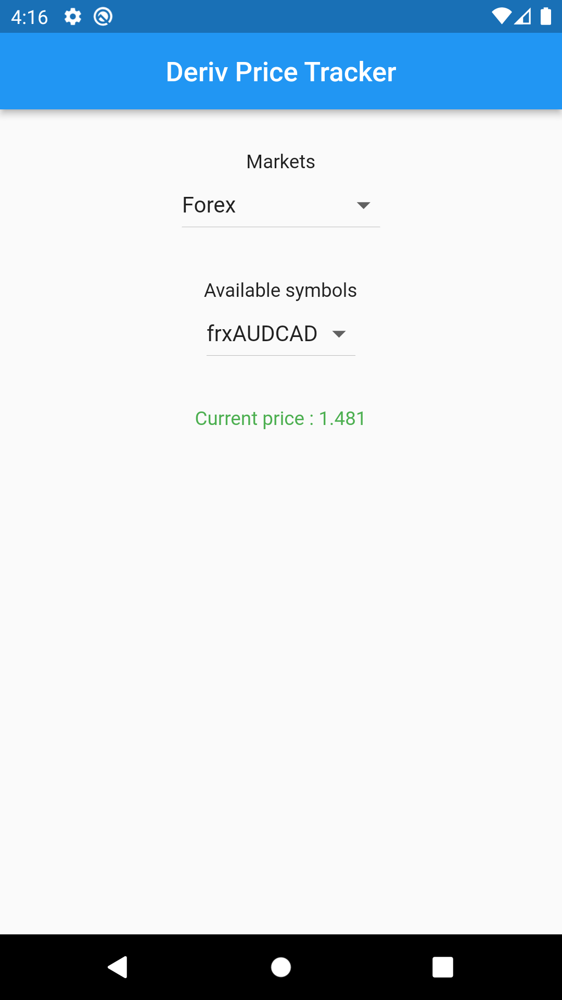

# deriv_price_tracker

A Flutter application to retrieve Deriv market related details using [binary.com developers API](https://developers.binary.com/)

 

## Features

- Select markets
- Select available symbols based on markets
- Get current price based on market and symbol
